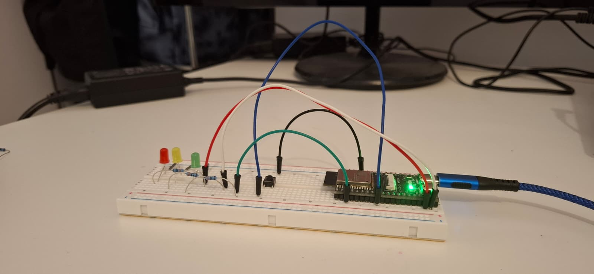

# Integración de ESP32, MQTT y RoboDK

Proyecto práctico que conecta hardware físico con un entorno de simulación industrial en RoboDK mediante un broker MQTT. 

El sistema permite una comunicación bidireccional:
* **Físico a Virtual:** Al pulsar un botón en la ESP32, se envía un comando a través de MQTT para actualizar el estado en RoboDK.
* **Virtual a Físico:** El entorno de simulación puede enviar señales para activar LEDs de estado y mover el robot en la celda virtual.

---

## Estructura de Archivos

### 🐍 Control en Python (RoboDK)
* **`MqttListener.py`**: Conecta con el broker MQTT y gestiona los mensajes entrantes.
* **`RobotController.py`**: Procesa los comandos y ejecuta acciones (como iniciar secuencias en segundo plano).
* **`Leds_conf.py`**: Controla la visibilidad de los LEDs (rojo, verde, amarillo) en el entorno 3D.
* **`Movimientos.py`**: Define las trayectorias y movimientos del robot.
* **`Main_para_probar_semaforos.py`**: Script de prueba para la secuencia de los semáforos.

### 🔌 Código de Arduino / ESP32 (C++)
* **`mqtt_a_ard.ino`**: Archivo principal del microcontrolador.
* **`w_loop.ino`**: Lógica para la lectura del botón y detección de flancos (*edge detection*).
* **`g_comunicaciones.ino`**: Callback para procesar los mensajes MQTT.
* **`s_setup.ino`**: Configuración inicial de los pines.

*(Nota: El archivo `Config.h` se ha omitido de este repositorio para proteger los datos personales y de la red de la universidad).*

---

## Código Destacado

### 1. Control de Simulación en Python (`RobotController.py`)

````python
import threading
import Leds_conf as leds

station_commands_topic = "giirob/pr2/station/demo/commands"

def handle_message(mqttc, topic, payload, init_all, simulacion):
    msg = payload.strip()
    
    if topic == station_commands_topic: 
        if msg == "1":
            # Creamos un hilo para ejecutar la secuencia de luces sin bloquear el cliente
            hilo_leds = threading.Thread(target=leds.secuencia_semaforo, args=(mqttc, "giirob/pr2/station/demo/status"))
            hilo_leds.start() 

def move_robot(position):
    robot = RDK.Item("myRobotUR", ITEM_TYPE_ROBOT)
    target = RDK.Item(position).setAsCartesianTarget()
    if robot.Valid() and target.Valid():
        robot.MoveJ(target)
````

### 2. Lógica del Hardware en ESP32 (`w_loop.ino.c`)

````cpp

const int BUTTON_PIN = 17; 
const int LED_PIN = 6; 

static int lastButtonState = HIGH; 
static int ledState = LOW;

void on_loop() {
    int currentButtonState = digitalRead(BUTTON_PIN);
    
    // Detección de flanco de bajada (de no pulsado a pulsado)
    if (lastButtonState == HIGH && currentButtonState == LOW) {
        ledState = !ledState;
        digitalWrite(LED_PIN, ledState);
        
        if (ledState == HIGH) {
            // enviarMensajePorTopic("giirob/pr2/devices/andreaxd", "on");
            Serial.println("-> Mensaje MQTT Enviado: on");
        } else {
            // enviarMensajePorTopic("giirob/pr2/devices/andreaxd", "off");
            Serial.println("-> Mensaje MQTT Enviado: off");
        }
    }
    lastButtonState = currentButtonState;
    delay(50); // Anti-rebote (Debounce)
}
````
## Galeria

